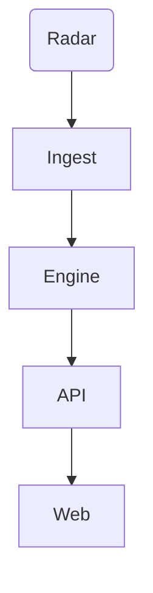

# Architecture

## 1. Overview & Goals
Vajra provides an end-to-end framework for parsing radar, inferring storm movement, and sending standard CAP alerts.

## 2. System Context Diagram
(IMPLEMENTED backend APIs, DEMONSTRATED ML logic, DESIGNED national scale)

## 3. End-to-End Data Flow
- **Ingest**: (IMPLEMENTED) Parses IMD sweeps.
- **Engine**: (DEMONSTRATED) Optical Flow persistence.
- **API**: (IMPLEMENTED) FastAPI websockets.

## 4. Component Catalogue
- **`services/ingest`**: (IMPLEMENTED) Reads streams.
- **`services/engine`**: (DEMONSTRATED) Tracks frames.
- **`apps/api`**: (IMPLEMENTED) Distributes data.
- **`apps/web`**: (IMPLEMENTED) Renders UI.

## 5. Data Model
- **Zarr Layout**: (DESIGNED) N-dimensional chunks for fast access.
- **Bundle Format**: (IMPLEMENTED) `manifest.json`, `eta.json`, `hazards.json`.

## 6. ETA Countdown Algorithm
(IMPLEMENTED in web, DEMONSTRATED in backend bundles)
Reads distance to polygon intercepts over velocity vectors to compute p10, p50, p90 arrival times.

## 7. Hazard Methods
(DEMONSTRATED) Rule-based formulas using dbz thresholds:
- Hail: dBZ > 55
- Heavy Rain: dBZ > 40

## 8. Provenance and Honesty Model
(IMPLEMENTED) All API outputs include a provenance dict mapping `status` (simulated/real), `engine`, `method`, and `skilful` flags.

## 9. API and Event Contract
(IMPLEMENTED) `/v1/stream`, `/v1/eta`, `/v1/alerts`.

## 10. Alerting and Governance
(IMPLEMENTED) CAP 1.2 compliant payload generation, role-based approval endpoints, kill-switch functionality.

## 11. UI Architecture
(IMPLEMENTED) Next.js, MapLibre GL JS, deck.gl, TailwindCSS.

## 12. Deployment Views
(IMPLEMENTED) Static Export demo in `apps/web/out`.

## 13. Scalability Design
(MODELLED) 
- Partitioning, message bus, GPU batching.
- Scalability to 30 active storms modelled at 5 stateless nodes (extrapolated from single-node 6.7s per 5 scenarios baseline).

## 14. Security and Threat Model
(IMPLEMENTED) RBAC for alerts, kill switch, static SPA hardening.

## 15. Failure Modes
(IMPLEMENTED) Network drops trigger fallback empty states in UI.

## 16. Technology Choices
(IMPLEMENTED) FastAPI (perf), Next.js (SSG), Zarr (chunking).

## 17. Built vs Designed (Honest Table)
| Component | Status |
|---|---|
| Ingest Decoders | IMPLEMENTED |
| Optical Flow | DEMONSTRATED |
| Distributed Kafka | DESIGNED |

## 18. Roadmap
(NOT STARTED) Train deep learning ML tracker.

## 19. Glossary
CAP: Common Alerting Protocol
ETA: Estimated Time of Arrival
