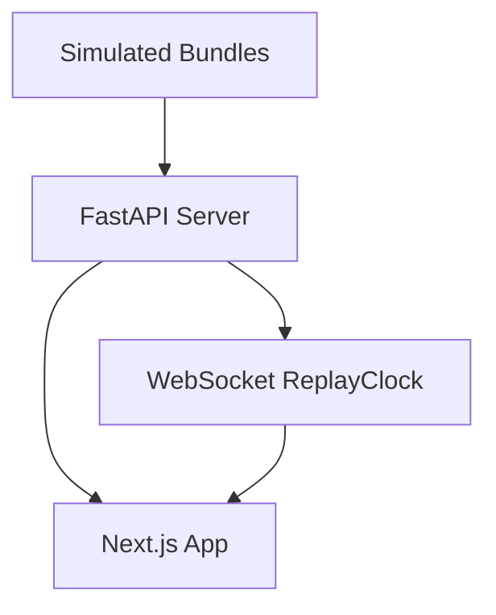
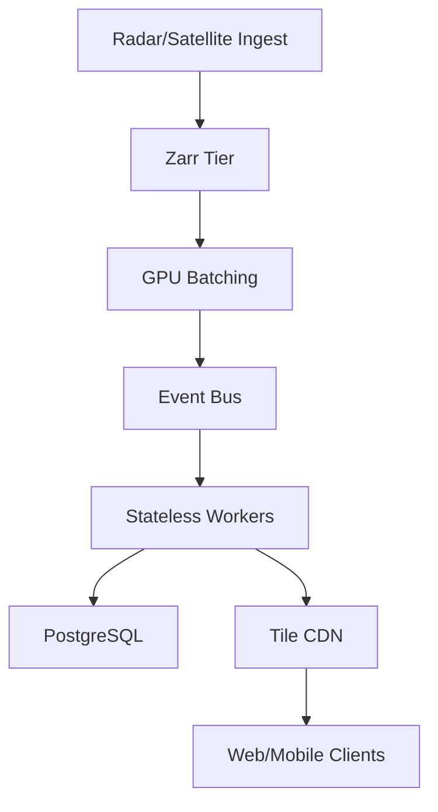

# Architecture

## Demo Environment Architecture

```mermaid
graph TD
    B[Simulated Bundles] --> API[FastAPI Server]
    API --> UI[Next.js App]
    API --> Stream[WebSocket ReplayClock]
    Stream --> UI
```

## National Target Architecture

```mermaid
graph TD
    Ingest[Radar/Satellite Ingest] --> Zarr[Zarr Tier]
    Zarr --> GPU[GPU Batching]
    GPU --> Bus[Event Bus]
    Bus --> Workers[Stateless Workers]
    Workers --> DB[PostgreSQL]
    Workers --> CDN[Tile CDN]
    CDN --> Clients[Web/Mobile Clients]
```
