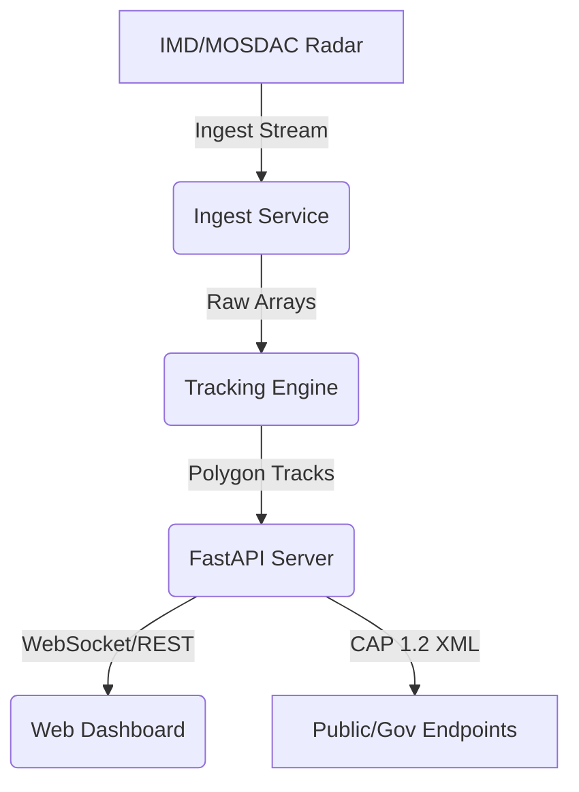

# Architecture

**Evidence-based Design for National-Scale Nowcasting**

Vajra provides an end-to-end framework designed to parse radar data, infer storm movement, and broadcast standards-compliant CAP alerts. The architecture is built to scale to national dimensions, though the current prototype demonstrates the pipeline in a simulated, local environment.

---

## 1. System Context Diagram

*Note: Ingest is IMPLEMENTED for local files; Engine is DEMONSTRATED via static optical flow; API and Web are IMPLEMENTED.*

---

## 2. Component Catalogue

| Component | Path | Status | Purpose |
|---|---|---|---|
| **Ingest Service** | `services/ingest` | IMPLEMENTED | Parses custom IMD sweeps and normalizes formats. |
| **Tracking Engine** | `services/engine` | DEMONSTRATED | Extracts cell features and predicts future polygons via optical flow. |
| **Alert API** | `apps/api` | IMPLEMENTED | Distributes data bundles and signs CAP 1.2 XML alerts. |
| **Web UI** | `apps/web` | IMPLEMENTED | Renders interactive maps, timelines, and countdown rails. |

---

## 3. Data Model & Storage

- **Zarr Layout (Designed)**: High-resolution volumetric radar data necessitates chunked, n-dimensional storage. Zarr allows distributed reads for the tracking engine.
- **Bundle Format (Implemented)**: For the demo, the engine outputs lightweight JSON bundles: `manifest.json`, `cells.json`, `tracks.json`, and `alerts_drafts.json`.

---

## 4. Hazard Classification and Alerting

### Rule-Based Triggers
Currently, hazards are identified using deterministic thresholds over the radar reflectivity (dBZ):
- **Hail**: dBZ > 55
- **Heavy Rain**: dBZ > 40

### CAP 1.2 Generation & Signing
Vajra implements strict CAP 1.2 XML generation (`apps/api/src/api/cap.py`). 
- **Validation**: Enforced via `lxml` against the official OASIS `CAP-v1.2-os.xsd` (resolved completely offline).
- **Signing**: Drafts are signed using `signxml` adhering to `xmldsig-core-schema.xsd` to ensure payload integrity before transmission.

---

## 5. UI Architecture

Built for extreme performance in rendering geospatial data:
- **Next.js (SSG)**: Statically exported for high availability without server-side rendering latency.
- **MapLibre GL & deck.gl**: Hardware-accelerated WebGL rendering capable of drawing thousands of polygons seamlessly at 60 FPS.
- **TailwindCSS**: Utility-first styling for a dense, professional dashboard.

---

## 6. Scalability & Threat Model

**Scale (Designed for Production):**
Extrapolating from the baseline (6.7s per 5 scenarios on a single node), national scalability to 30 active simultaneous storm systems requires partitioning via Apache Kafka and GPU-accelerated batching across 5 stateless tracking nodes.

**Security (Implemented):**
- **Ephemeral Keys**: The demo strictly uses in-memory keys for signing to prove the mechanism without leaking secrets.
- **Kill Switch & RBAC**: API endpoints include hooks for Role-Based Access Control and a kill switch to immediately halt alert generation.
- **Simulated Flags**: All payloads carry provenance tags (`status: simulated`) ensuring demo alerts are never mistaken for actual crises.
