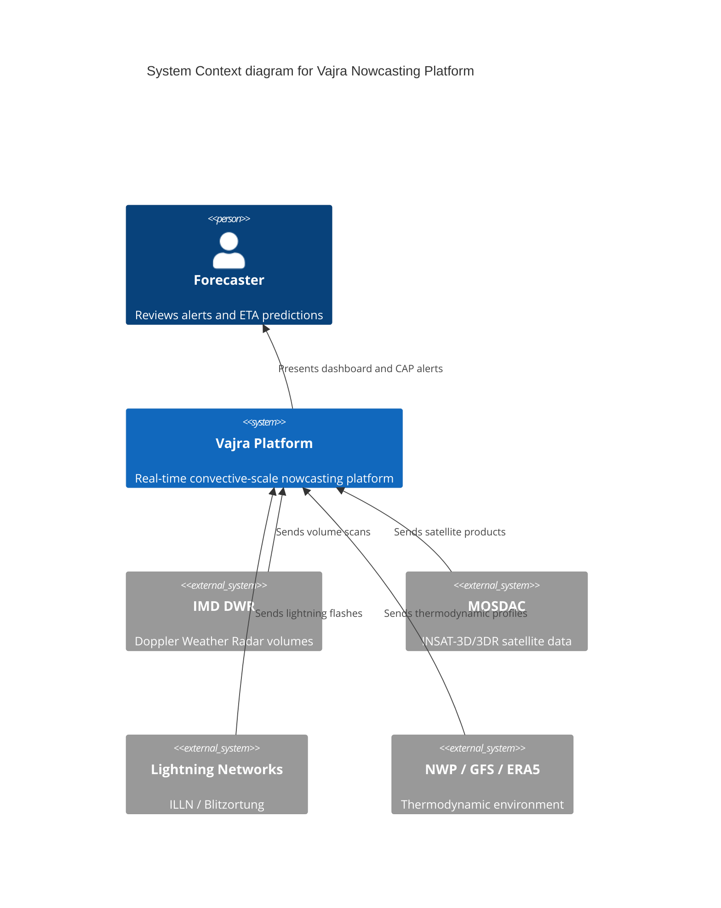

# Architecture Overview

## Internal CRS

- **EPSG:7755 (WGS 84 / India NSF LCC)** is the internal standard for metric calculations (e.g. cell area, speed, distance) because it is a conformal projection tailored for India, minimising shape distortion and preserving angles, which is critical for accurate trajectory and velocity calculations of storm cells.

See `docs/adr/ADR-002-architecture.md` for the core architectural decisions.
