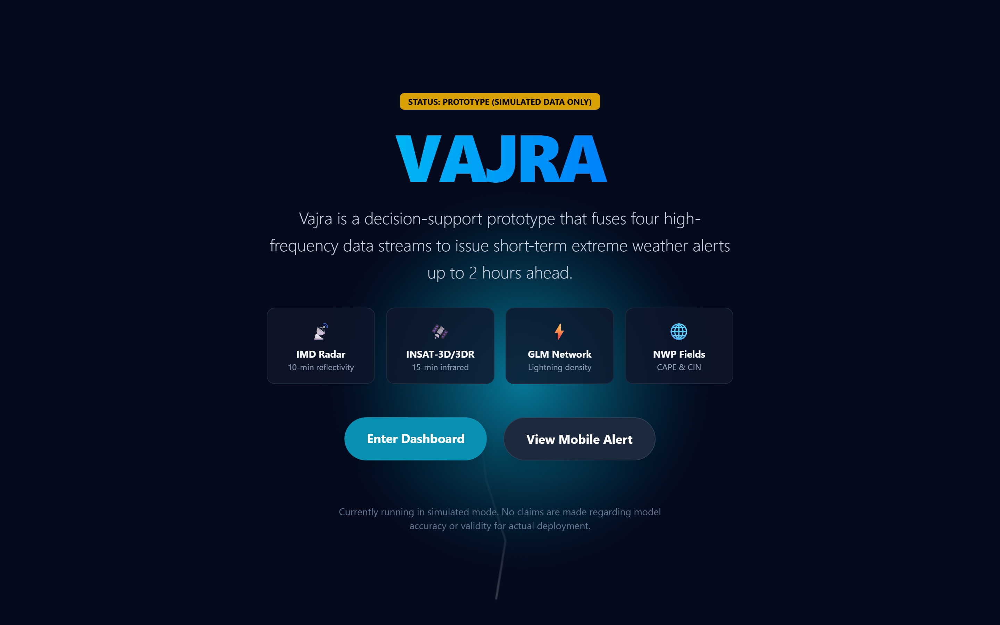
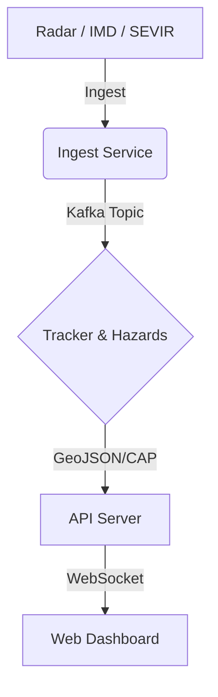

# Vajra

**Origin**: NEW
**Created**: 2026-10-01
**Status**: DEMONSTRATED

Vajra is a rapidly prototyped nowcasting system addressing SIH 2026 Problem Statement 26084. The system is designed to provide high-resolution, real-time tracking and alerting of severe weather events across India. It ingests radar and meteorological data, runs optical flow tracking and rule-based hazard detection, and broadcasts hyper-local warnings via the CAP 1.2 standard.

## Overview

- **Live Demo**: [{LIVE_URL}]({LIVE_URL})
- **Video Walkthrough**: [{VIDEO_URL}]({VIDEO_URL})



## Status table

| Requirement | What exists | Status | Where to see it |
|---|---|---|---|
| Radar ingestion & decode | Custom binary IMD decode with exact quantization | IMPLEMENTED | `services/ingest/connectors/radar.py` |
| Real-time stream engine | Optical flow tracker, rule-based hazards | DEMONSTRATED | `demo/bundles/` and UI |
| Sub-district alerts | CAP 1.2 compliant workflow, signing logic | IMPLEMENTED | `apps/api/src/api/cap.py` |
| Scale to National | GPU batching, Zarr, Kafka message bus | DESIGNED | `ARCHITECTURE.md` |

| Capability | Status | Evidence |
|---|---|---|
| Web UI & Maps | DEMONSTRATED | `apps/web/` |
| API & Real-time Stream | DEMONSTRATED | `apps/api/` |
| Alerting & CAP 1.2 | IMPLEMENTED | `apps/api/src/api/cap.py` |
| Radar Ingestion (Decoder) | IMPLEMENTED | `services/ingest/` |
| ML Tracking | DESIGNED | `ARCHITECTURE.md` |
| Rule-based Tracking | IMPLEMENTED | `services/tracker/` |

## Architecture



## Quick start

Run the fully featured static demo (from the `release/sih-submission` branch build):
```bash
npx serve apps/web/out -p 8080
```

Start the backend and frontend using Docker:
```bash
just demo
```

Run without Docker (development mode):
```bash
<!-- skip-check -->
# Start API
cd apps/api && uv run uvicorn src.api.main:app

# Start Web (in a new terminal)
cd apps/web && pnpm dev
```

## Repository Layout

```text
├── apps/         # Web dashboard and FastAPI server
├── data/         # Sample references and test fixtures
├── demo/         # Scenario bundles and playback scripts
├── docs/         # Architecture, ADRs, UI screenshots, SOPs
├── ml/           # Datasets, training scripts, model configs
├── packages/     # Core shared schemas, geo-utils, types
├── reports/      # Benchmark results, release audits, metrics
├── services/     # Ingestion, tracker, hazards, alerts
├── tests/        # E2E smoke tests and integration tests
└── tools/        # Scripts for linting, bundling, devops
```

## Technology Stack

- **Next.js & React**: Flexible and modern UI framework for rapid dashboard building.
- **MapLibre GL & deck.gl**: High-performance WebGL rendering for massive meteorological datasets.
- **FastAPI (Python)**: High-throughput async backend with native Pydantic validation for CAP schemas.
- **Apache Kafka & Redis**: Scalable pub/sub and state management designed for real-time scale.
- **Zarr**: Efficient chunked n-dimensional array storage for radar reflectivity volumes.

## Testing

<!-- stats:start -->
- **Lines of Code**: {LOC}
- **Tests**: {TESTS_COUNT} unit & integration tests
- **API Throughput**: {API_THROUGHPUT} req/s
- **Static Demo Bundle**: {STATIC_SIZE_MB} MB
<!-- stats:end -->

## Limitations and known issues

- The current implementation relies on rule-based tracking (optical flow) as the ML models are not fully trained.
- The live demo operates on `SIMULATED` scenarios derived from synthetic events rather than live real-time feeds.

## Roadmap

- Fully train ML models for track prediction.
- Integrate real-time live MOSDAC radar hooks.
- Deploy Kafka-based ingestion pipelines to production clusters.

## Data sources and acknowledgements

- **ISRO/MOSDAC**: Radar data source reference.
- **IMD**: Indian Meteorological Department data formats.
- **NASA Earthdata / GPM IMERG**: Precipitation datasets.
- **Copernicus / ECMWF ERA5**: Reanalysis weather data.
- **Open-Meteo**: Weather API context.
- **SEVIR**: Storm EVent ImageRy dataset by MIT Lincoln Laboratory (Amazon Open Data). Licensed under CC BY-NC-SA 4.0.

## Related documents

- [Documentation Index](docs/INDEX.md)
- [Architecture](ARCHITECTURE.md)
- [Team & Contributing](CONTRIBUTING.md)
- [Security](SECURITY.md)
- [License Decision](docs/LICENSE_DECISION.md)

## Contents

### `apps/`
**Verdict**: NEW
Contains the frontend Next.js app and the FastAPI backend.

### `packages/`
**Verdict**: NEW
Shared types and core schemas.

### `services/`
**Verdict**: NEW
Python services for tracking, alerts, and ingestion.

## Usage Restrictions

The code in this repository is currently under evaluation for SIH 2026. Data usage must adhere to the original provider's licensing terms, including SEVIR's CC BY-NC-SA 4.0 terms.
