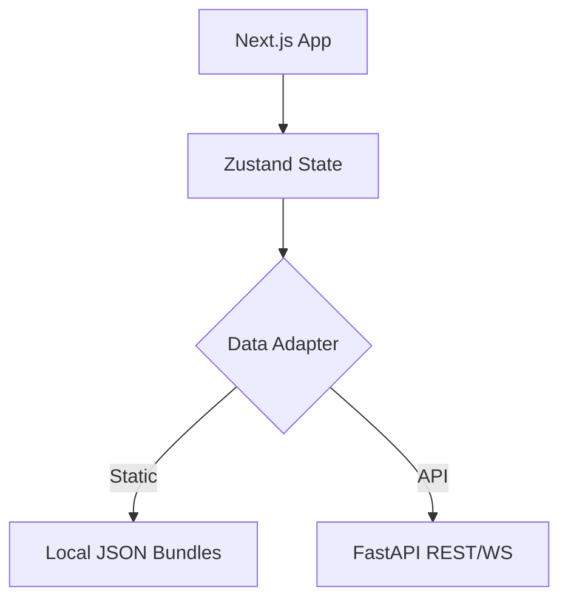

# Web App

**Origin**: NEW
**Created**: 2026-10-01
**Status**: DEMONSTRATED

Vajra Web is a Next.js frontend providing a highly interactive dashboard for real-time tracking, map visualization, and alert composing.

## Overview

A modern React-based application showcasing map layers with `deck.gl`, real-time cell inspectors, and a scenario picker. It can run connected to the backend API or fully statically from pre-computed data bundles.

## Architecture



## Routes & Pages

| Route | Description |
|---|---|
| `/` | Landing page (Hero, Demo Links) |
| `/map` | Main dashboard with interactive map timeline |
| `/scenarios` | Scenario picker |
| `/m` | Mobile view for public alerts |

## Configuration

| Variable | Description |
|---|---|
| `NEXT_PUBLIC_API_URL` | URL of the API |
| `NEXT_PUBLIC_STATIC_EXPORT` | If `true`, enables static mode |

## Commands

```bash
<!-- skip-check -->
pnpm dev
pnpm build
pnpm start
```

## Testing

Uses `vitest` for unit tests and `playwright` for smoke/E2E testing.
```bash
<!-- skip-check -->
pnpm test
pnpm e2e
```

## Limitations and known issues

- Some dynamic features are limited in static export mode.
- Accessibility is pending comprehensive audit.

## Contents

### `src/`
**Verdict**: IMPLEMENTED
Contains the application source code (pages, components, stores, lib).

### `public/`
**Verdict**: IMPLEMENTED
Static assets including bundled demo data.

### `package.json`
**Verdict**: IMPLEMENTED
Dependencies and scripts.

## Usage Restrictions

Must not be deployed to production without replacing the simulated data sets.
