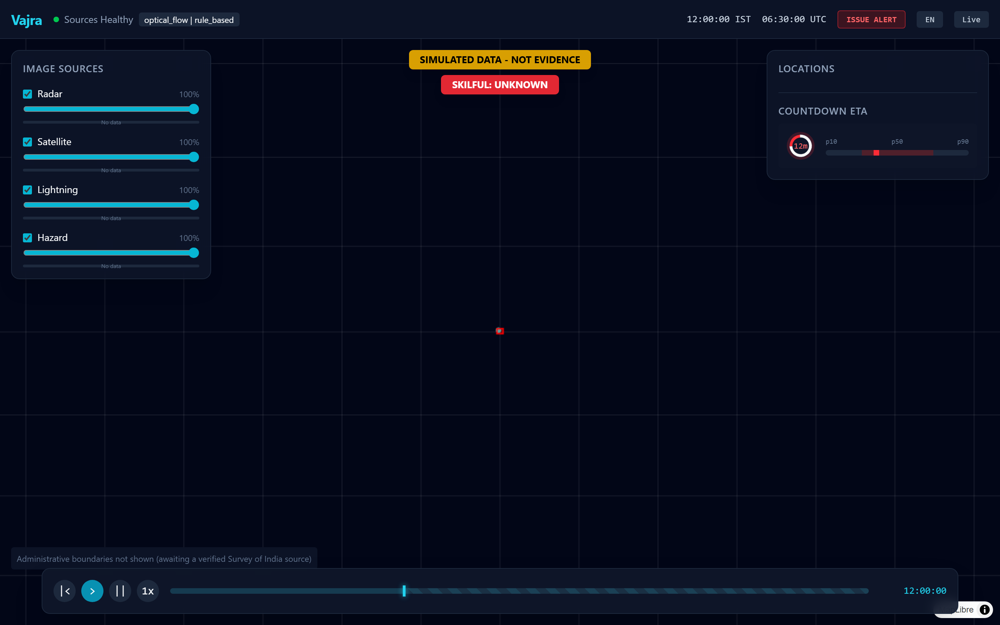
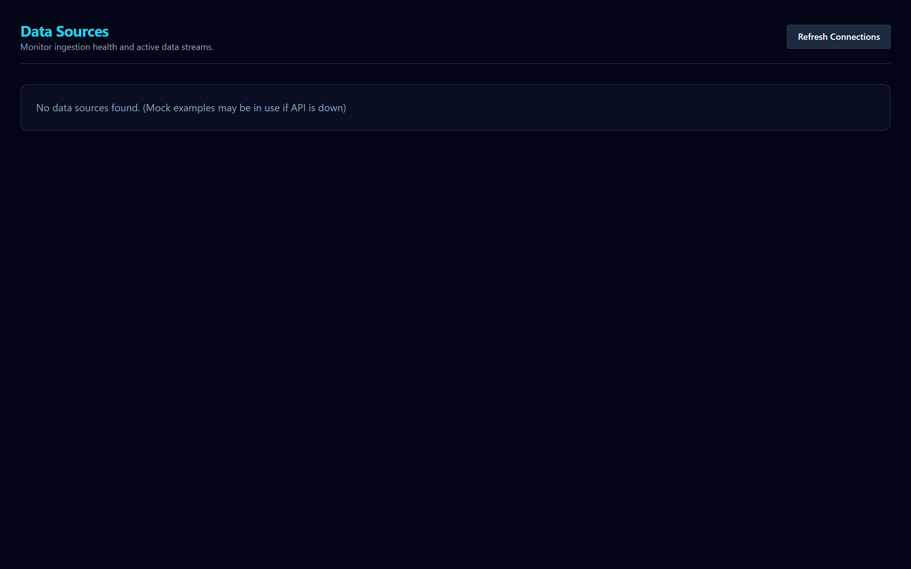

# Screenshots Index

| Thumbnail | Title | Description | Scenario | Viewport | Date | Banners Visible? |
|---|---|---|---|---|---|---|
|  | Landing Page | Landing page describing the project. | SIMULATED (various) | Desktop 1440x900 | 2026-10-03 | Yes |
|  | Map & Timeline | Main map interface showing the timeline playing. | SIMULATED (various) | Desktop 1440x900 | 2026-10-03 | Yes |
|  | Countdown Rail | Map UI highlighting the countdown rail. | SIMULATED (various) | Desktop 1440x900 | 2026-10-03 | Yes |
|  | Cell Inspector | Cell inspector showing cell details and ETA. | SIMULATED (various) | Desktop 1440x900 | 2026-10-03 | Yes |
|  | Alert Composer | Alert composer with CAP XML preview. | SIMULATED (various) | Desktop 1440x900 | 2026-10-03 | Yes |
|  | Real Data Page | Real data viewer interface. | REAL (various) | Desktop 1440x900 | 2026-10-03 | Yes |
|  | Mobile View | Responsive mobile interface for public alerts. | SIMULATED (various) | Mobile 390x844 | 2026-10-03 | Yes |
|  | Scenario Picker | Dropdown for selecting simulated scenarios. | SIMULATED (various) | Desktop 1440x900 | 2026-10-03 | Yes |
